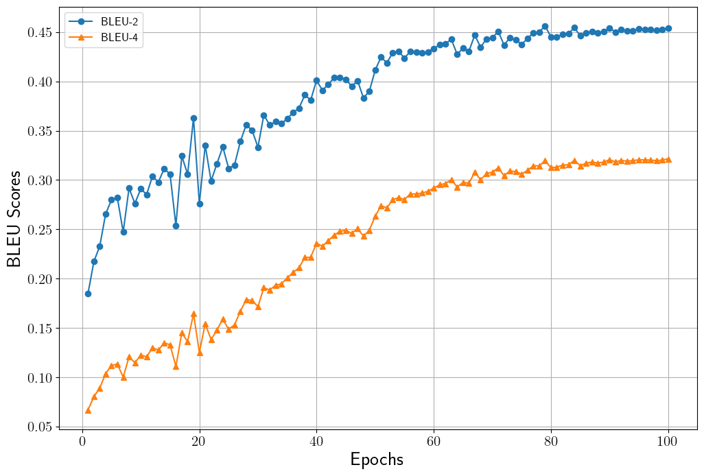
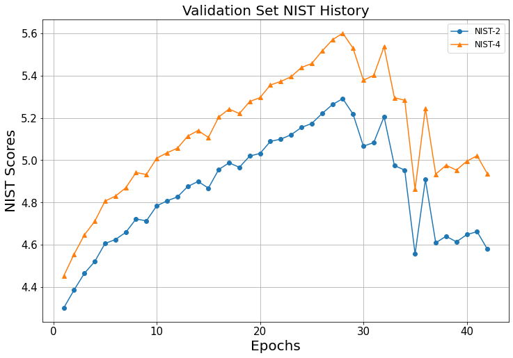

# Multi-turn Chatbot GPT-2
## 설명
본 코드는 [DailyDialog](http://yanran.li/dailydialog) 데이터셋과 pre-trained GPT-2 바탕으로 multi-turn 챗봇 모델을 학습합니다.
본 프로젝트에 사용하는 GPT-2는 [Hugging Face GPT-2의 "gpt2" pre-trained 모델](https://huggingface.co/docs/transformers/model_doc/gpt2)입니다.
GPT-2를 이용한 multi-turn 챗봇 모델 학습에 대한 설명은 [GPT-2와 DailyDialog를 이용한 Multi-turn 챗봇 구현](https://ljm565.github.io/contents/gpt2.html)를 참고하시기 바랍니다.
<br><br><br>

## 모델 종류
* ### Pre-trained GPT-2
    Multi-turn 챗봇을 학습하기 위해 Hugging Face pre-trained GPT-2를 학습합니다.
<br><br><br>


## 토크나이저 종류
* ### Pre-trained GPT-2 Tokenizer
    Hugging Face의 Pre-trained GPT-2 토크나이저를 사용합니다.
<br><br><br>

## 사용 데이터
* 실험으로 사용하는 데이터는 [DailyDialog](http://yanran.li/dailydialog) 데이터셋입니다.
<br><br><br>


## 사용 방법
* ### 학습 방법
    학습을 시작하기 위한 argument는 4가지가 있습니다.<br>
    * [-d --device] {cpu, gpu}, **필수**: 학습을 cpu, gpu로 할건지 정하는 인자입니다.
    * [-m --mode] {train, inference, chatting}, **필수**: 학습을 시작하려면 train, 학습된 모델을 가지고 있어서 BLEU, NIST 및 sample을 보고싶은 경우에는 inference, 학습된 모델로 채팅을 하기 위해서는 chatting으로 설정해야합니다. inference 및 chatting을 사용할 경우, [-n, --name] 인자가 **필수**입니다.
    * [-c --cont] {1}, **선택**: 학습이 중간에 종료가 된 경우 다시 저장된 모델의 체크포인트 부분부터 학습을 시작할 수 있습니다. 이 인자를 사용할 경우 -m train 이어야 합니다. 
    * [-n --name] {name}, **선택**: 이 인자는 -c 1 혹은 -m {inference, chatting} 경우 사용합니다.
    중간에 다시 불러서 학습을 할 경우 모델의 이름을 입력하고, inference 및 chatting을 할 경우에도 모델의 이름을 입력해주어야 합니다(최초 학습시 src/config.json에서 정한 모델의 이름의 폴더가 형성되고 그 폴더 내부에 모델 및 모델 파라미터가 json 파일로 형성 됩니다).<br><br>

    터미널 명령어 예시<br>
    * 최초 학습 시
        ```
        python3 src/main.py -d cpu -m train
        ```
    * 중간에 중단 된 모델 이어서 학습 시
        <br>주의사항: config.json을 수정해야하는 일이 발생 한다면 base_path/src/config.json이 아닌, base_path/src/model/{model_name}/{model_name}.json 파일을 수정해야 합니다.
        ```
        python3 src/main.py -d gpu -m train -c 1 -n {model_name}
        ```
    * 최종 학습 된 모델의 test set에 대한 BLEU, NIST 및 sample을 확인할 시
        <br>주의사항: config.json을 수정해야하는 일이 발생 한다면 base_path/src/config.json이 아닌, base_path/src/model/{model_name}/{model_name}.json 파일을 수정해야 수정사항이 반영됩니다.
        ```
        python3 src/main.py -d cpu -m inference -n {model_name}
        ```
    <br><br>

* ### 모델 학습 조건 설정 (config.json)
    **주의사항: 최초 학습 시 config.json이 사용되며, 이미 한 번 학습을 한 모델에 대하여 parameter를 바꾸고싶다면 base_path/model/{model_name}/{model_name}.json 파일을 수정해야 합니다.**
    * pretrained_model: gpt2, gpt2-medium, gpt2-large 등 pre-trained GPT-2 모델 선택.
    * base_path: 학습 관련 파일이 저장될 위치.
    * model_name: 학습 모델이 저장될 파일 이름 설정. 모델은 base_path/src/model/{model_name}/{model_name}.pt 로 저장.
    * loss_data_name: 학습 시 발생한 loss data를 저장하기 위한 이름 설정. base_path/src/loss/{loss_data_name}.pkl 파일로 저장. 내부에 중단된 학습을 다시 시작할 때, 학습 과정에 발생한 loss 데이터를 그릴 때 등 필요한 데이터를 dictionary 형태로 저장.
    * max_len: 학습할 multi-turn 문장 최대 길이.
    * batch_size: batch size 지정.
    * epochs: 학습 epoch 설정.
    * lr: learning rate 지정.
    * early_stop_criterion: validation set의 최대 accuracy를 내어준 학습 epoch 대비 설정된 숫자만큼 epoch이 지나도 나아지지 않을 경우 학습 조기 종료.
    * result_num: 모델 테스트 시, 결과를 보여주는 sample 개수.
    <br><br><br>


## 결과
* ### Multi-turn GPT-2 챗봇 모델 결과
    * BLEU Score History<br>
    <br><br>

    * NIST History<br>
    <br><br>
    
    * 최종 Test Set Scores<br>
        Validation set accuracy가 가장 높았던 100 epoch 모델을 test set에 적용한 결과입니다.
        100 epoch을 돌면서 validation set의 결과는 꾸준히 개선되고 있었지만 시간 관계상 100 epoch만을 돌렸습니다.<br>
        * BLEU-2: 0.4736
        * BLEU-4: 0.3479
        * NIST-2: 6.3979
        * NIST-4: 7.1139


<br><br><br>