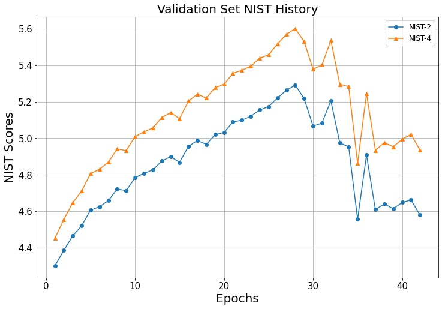

# Multi-turn Chatbot GPT-2
한국어 버전의 설명은 [여기](./docs/README_ko.md)를 참고하시기 바랍니다.

## Introduction
The following code trains a multi-turn chatbot model based on the [DailyDialog](http://yanran.li/dailydialog) dataset and a pre-trained GPT-2 model.
The GPT-2 used in this project is the ["gpt2" pre-trained model](https://huggingface.co/docs/transformers/model_doc/gpt2) from Hugging Face.
For a detailed explanation of training a multi-turn chatbot model using GPT-2 and DailyDialog, please refer to [GPT-2와 DailyDialog를 이용한 Multi-turn 챗봇 구현](https://ljm565.github.io/contents/gpt2.html).
<br><br><br>

## Supported Models
### Pre-trained GPT-2
* Pre-trained GPT-2 from Hugging Face.
<br><br><br>


## Supported Tokenizer
### Pre-trained GPT-2 Tokenizer
* Pre-trained GPT-2 tokenizer from Hugging Face.
<br><br><br>

## Base Dataset
* [DailyDialog](http://yanran.li/dailydialog) multi-turn dataset.
* If you want to use your custom data, you have to set train/validation/test data paths in the `config/config.yaml`. Also, you have to implement your custom tokenizer, data loading parts in the `src/trainer/build.py`.
<br><br><br>


## Supported Devices
* CPU, GPU, multi-GPU (DDP), MPS (for Mac and torch>=1.12.0)
<br><br><br>

## Quick Start
```bash
python3 src/run/train.py --config config/config.yaml --mode train
```
<br><br>


## Project Tree
This repository is structured as follows.
```
├── configs                           <- Folder for storing config files
│   └── *.yaml
│
└── src      
    ├── models
    |   └── gpt2.py                   <- GPT-2 model wrapper
    |
    ├── run                   
    |   ├── chatting.py               <- Trained model live demo execution code
    |   ├── train.py                  <- Training execution file
    |   └── validation.py             <- Trained model evaulation execution file
    |
    ├── tools                   
    |   ├── tokenizers
    |   |   └── tokenizer.py          <- Tokenizer class
    |   ├── early_stopper.py          <- Early stopper class file
    |   ├── evaluator.py              <- Metric evaluator class file
    |   ├── model_manager.py          
    |   └── training_logger.py        <- Training logger class file
    |
    ├── trainer                 
    |   ├── build.py                  <- Codes for initializing dataset, dataloader, etc.
    |   └── trainer.py                <- Class for training, evaluating, and calculating accuracy
    |
    └── uitls                   
        ├── __init__.py               <- File for initializing the logger, versioning, etc.
        ├── data_utils.py             <- File defining the dataset's dataloader
        ├── filesys_utils.py       
        ├── func_utils.py       
        └── training_utils.py     
```
<br><br>

## Tutorials & Documentations
Please follow the steps below to train a multi-turn chatbot model.
1. [Getting Started](./docs/1_getting_started.md)
2. [Data Preparation](./docs/2_data_preparation.md)
3. [Training](./docs/3_trainig.md)
4. ETC
   * [Evaluation](./docs/4_model_evaluation.md)
   * [Live Demo](./docs/5_live_demo.md)

<br><br><br>


## Training Results
### Results of GPT-2-based Multi-turn Chatbot Model
* BLEU Score History<br>
<br><br>

* NIST Score History<br>
<br><br>

* Test Set Scores<br>
The results of applying the model, which achieved the highest metric on the validation set, to the test set.
    * BLEU-2: 0.4052
    * BLEU-4: 0.2268
    * NIST-2: 5.1797
    * NIST-4: 5.5162
    <br><br>

### Multi-turn GPT-2 Dialogue Results
"Q" represents user (your inputs) message, and "A" represents the chatbot's response.
```
Q: Have you ever been to France
A: Oh, yes! I went there once last summer.
Q: How was there?
A: It was amazing.
Q: Which spot was your best?
A: That of the Louvre.

Q: Did you see her yesterday?
A: Yes, I did. I saw her with a pretty girl.
Q: Oh where did you see her?                       
A: She was in a cafe. She told me she was going to a concert.
Q: I see. I've tried to contact her by phone, but she never received my call.
A: I'm sure she was in New York. She said she'd be in New York at the latest.
Q: Really? Thank you for your information. I will contact her today. Thanks.
```

<br><br><br>